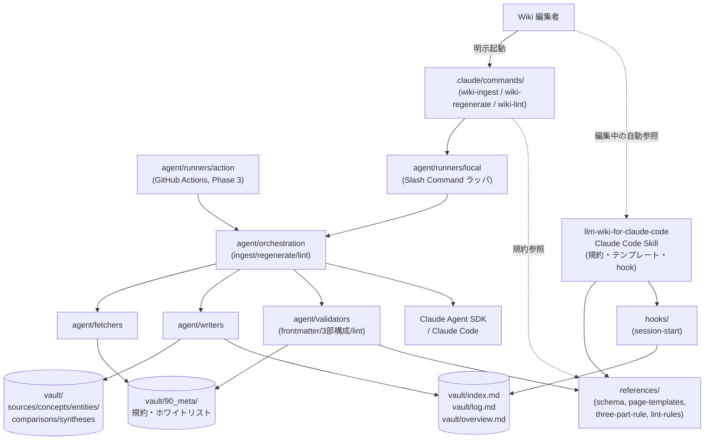

# 設計書

## アーキテクチャ概要

Phase 1 では **「Claude Code Slash Command + Skill + 環境非依存ロジック層 + 薄いランナー」** の4要素アーキテクチャの最小骨格を構築する（ADR-014）。
Phase 2 / 3 で同じ骨格を拡張するため、**インターフェースは将来追加（AUTO マーカー、GitHub Actions ランナー、`/wiki-query`、`comparison` 自動生成）を見越して定義** するが、Phase 1 ではモック / スタブで埋めて段階的に実装する。

ページ種別ベースの Wiki 構造（`vault/{sources, concepts, entities, comparisons, syntheses}/`）を採用し、Phase 1 では `source` 種別のみを実装対象とする。



### 採用方針

- **言語**: Phase 1 着手時に確定（ADR-010 として記録）。本設計では実装サンプルを Python 3.12+ で記載するが、TypeScript 5.x + Node 20 LTS 採用時も同等の構造を取る
- **4要素アーキテクチャ**: Slash Command 層（明示起動の操作）/ Skill 層（規約・テンプレート・hook の context-aware 提供）/ orchestration 層（ユースケース）/ runners 層（環境別エントリ）。Skill 内に `commands/` サブディレクトリは置かない（ADR-014）
- **ロジック層は環境非依存**: `runners/local` のみ Phase 1 で実装（Slash Command から呼ばれる）、`runners/action` のスタブだけ用意（Phase 3 で本実装）
- **規約は `vault/90_meta/` を SSoT** とし、Skill `references/` は `vault/90_meta/` のシンボリックリンクまたはビルド時コピーで生成（規約の二重管理を回避）
- **ページ種別駆動**: `agent/validators` は frontmatter の `type` 値に応じて適用ルールを切り替える（`source` のみ3部構成・連続100文字一致検出を強制、他種別は引用必須のみ）

## コンポーネント設計

### 1. Vault スケルトン（`vault/`）

**責務**:
- Wiki コンテンツ本体兼 Obsidian Vault のディレクトリ構造（ページ種別ベース）を保持
- ナビゲーション3点セット（`index.md` / `log.md` / `overview.md`）を Vault 直下に配置
- Phase 1 で実コンテンツを配置するのは `sources/official/{hooks,cli}/`, `90_meta/`, ナビゲーション3点の3箇所
- それ以外（`concepts/`, `entities/`, `comparisons/`, `syntheses/`, `sources/community/`, `sources/official/{slash-commands,mcp,settings,sdk}/`, `30_drafts/`）は空ディレクトリを `.gitkeep` で確保

**実装の要点**:
- `.obsidian/` の最小構成（`app.json` のみ）を Git 管理し、`workspace.json`、`cache/`、`hotkeys.json` 等の個別設定は `.gitignore` で除外
- ディレクトリ構造は `docs/core/repository-structure.md` の規定に厳密に従う
- `vault/index.md` は Phase 1 では空のテンプレート（Phase 2 以降で各操作後に自動更新）
- `vault/log.md` は追記専用、`## [YYYY-MM-DD] operation | description` 形式

### 2. 規約ドキュメント（`vault/90_meta/`）

**責務**: Wiki 運用の SSoT（Single Source of Truth）として、`agent/validators` の検証ルール導出元、および Skill `references/` の派生元になる

**配置ファイル**（Phase 1 で確定）:

| ファイル | 内容 |
|---------|------|
| `frontmatter-spec.md` | 共通必須キー + `type` 別必須キー、型、サンプル、`status` 遷移規則 |
| `markdown-rules.md` | 許可記法（CommonMark + Wikilinks + Mermaid）、禁止記法（Dataview, Callout 等）、`source` 種別の3部構成強制ルール |
| `sources.md` | 情報源ホワイトリスト（YAML ブロック形式）。Phase 1 では `anthropic-claude-docs` のみ |
| `license-notes.md` | Anthropic Usage Policy / docs.claude.com 利用規約整理、全文転載禁止原則 |
| `lint-rules.md` | `/wiki-lint` の検出項目（孤立ページ・陳腐化・矛盾・低信頼度・不足ページ・index 同期） |
| `_schemas/frontmatter.schema.json` | `type` 別の JSON Schema（`agent/validators` が参照） |

**実装の要点**:
- 各ファイルは「人間が読める Markdown」と「機械が読める YAML / 表形式 / JSON Schema」を併存させる
- `agent/validators` は `_schemas/frontmatter.schema.json` を参照して `type` 別検証を実施
- Skill `references/` は `vault/90_meta/` の対応ファイルへのシンボリックリンクまたはビルド時コピー（Phase 1 で確定）

### 3. `source` 種別記事（`vault/sources/official/{hooks,cli}/`）

**責務**: 規約準拠の3部構成記事を10本提供。Phase 2 以降の自動更新対象、および派生 `concept` / `entity` の引用元

**記事構造**:

```markdown
---
title: "Pre-Tool-Use Hook"
type: source
confidence: 0.9
sources: []                                    # source 種別自身は引用元なし
last_updated: 2026-05-05
stale: false
tags: [hooks, pre-tool-use]
source_url: "https://code.claude.com/docs/ja/hooks"
fetched_at: "2026-05-05T10:00:00Z"
source_version: null
claude_code_version: "1.5.0"
reviewer: "tak"
human_edited: true
status: published
auto_section_managed: false                    # Phase 2 で true 化予定
---

## 概要 (要約)
（公式の核となるポイントを日本語で要約。3-5文程度）

## 公式ドキュメント
→ https://code.claude.com/docs/ja/hooks
（最終確認: 2026-05-05 / 対象バージョン: 1.5.0）

## 補足解説 (日本語)
（実利用例、ハマりどころ、関連機能との関係）
```

**実装の要点**:
- ADR-003 の3部構成を厳格に守る（`source` 種別のみ強制）
- 公式コンテンツの連続100文字一致を避けるため、要約は日本語で再構成して書く
- Phase 1 では AUTO セクションマーカーは付与しない（Phase 2 で導入、`auto_section_managed: false` で明示）

### 3-A. Slash Command パッケージ（`.claude/commands/`）

**責務**: 明示起動の Wiki 操作の入り口。Wiki 操作（ingest/regenerate/lint）を Claude Code から `/wiki-*` コマンドで起動可能にする（ADR-014）

**配置ファイル**（Phase 1 で確定）:

| パス | 内容 |
|------|------|
| `.claude/commands/wiki-ingest.md` | 新ソース取込み手順（公式 URL を `source` 化）。内部で `agent ingest` を呼ぶ |
| `.claude/commands/wiki-regenerate.md` | 既存 source の再フェッチ + 派生ページ更新提案。内部で `agent regenerate` を呼ぶ |
| `.claude/commands/wiki-lint.md` | `/wiki-lint` 操作手順。内部で `agent lint` を呼ぶ |

**実装の要点**:
- 各 `*.md` は Claude Code に対する自然言語の指示書として書き、内部で `agent/runners/local` を呼ぶ
- 規約参照は `@.claude/skills/llm-wiki-for-claude-code/references/...` 形式で Skill `references/` を経由（規約の二重管理を回避）
- Phase 2 で `.claude/commands/wiki-query.md` を追加

### 3-B. Claude Code Skill パッケージ（`.claude/skills/llm-wiki-for-claude-code/`）

**責務**: 規約・テンプレート・hook を Wiki ページ編集時に context-aware に提供する。Skill 内に `commands/` サブディレクトリは置かない（ADR-014: 公式仕様外）

**配置ファイル**（Phase 1 で確定）:

| パス | 内容 |
|------|------|
| `SKILL.md` | Skill エントリ（`name`, `description`, `triggers`）。`description` は Wiki ページ編集時に context-aware にロードされる旨を含む |
| `references/schema.md` | `vault/90_meta/frontmatter-spec.md` のシンボリックリンク |
| `references/page-templates.md` | 5種別のテンプレート（Phase 1 では `source` のみ実体、他はスタブ） |
| `references/three-part-rule.md` | `vault/90_meta/markdown-rules.md` の3部構成抜粋 |
| `references/sources-whitelist.md` | `vault/90_meta/sources.md` のシンボリックリンク |
| `references/lint-rules.md` | `vault/90_meta/lint-rules.md` のシンボリックリンク |
| `hooks/session-start.md` | 起動時に `vault/index.md` 全体と `vault/log.md` 直近10件をロード |

**実装の要点**:
- Skill は frontmatter 編集や3部構成チェック等のコンテキストで自動ロードされる前提で `description` を記述
- Slash Command の `*.md` からも `references/` を参照することで、規約の二重管理を回避

### 4. agent/fetchers/

**責務**:
- ホワイトリスト済み情報源から最新コンテンツを取得し、`FetchResult` を返す
- レート制限を遵守（Phase 1 では実装は最小限、ログ出力のみで可）

**インターフェース**（言語非依存の概念）:

```python
# Python 例
from typing import Protocol
from dataclasses import dataclass

@dataclass
class FetchResult:
    raw_content: str
    fetched_at: str          # ISO 8601
    source_version: str | None
    content_hash: str        # SHA-256, 差分検知用

class Fetcher(Protocol):
    def fetch(self, source_id: str, target: str) -> FetchResult: ...
```

**Phase 1 実装範囲**:
- `http_fetcher`: HTTP GET で公式ドキュメントを取得（`anthropic-claude-docs` ソース対応）
- ホワイトリスト検証: `source_id` が `vault/90_meta/sources.md` に存在しない場合は `SourceNotWhitelistedError`

### 5. agent/writers/

**責務**:
- frontmatter + 本文の Markdown を出力 / 更新
- 既存記事との差分判定（タイムスタンプ等の機械的更新を除く本文差分で判定）

**インターフェース**:

```python
@dataclass
class WriteResult:
    file_path: str
    changed: bool         # 意味のある差分があったか
    diff_summary: str

class Writer(Protocol):
    def write(self, article: Article, body: str) -> WriteResult: ...
```

**Phase 1 実装範囲**:
- `markdown_writer`: 全文書き換え（AUTO 領域分離は Phase 2）
- `frontmatter` ユーティリティ: YAML frontmatter の読み書き（`gray-matter` / `python-frontmatter`）
- 冪等性のため、`fetched_at` 等のタイムスタンプ系フィールドは「ハッシュ一致時は更新しない」

### 6. agent/prompts/

**責務**: LLM プロンプトテンプレートを管理

**Phase 1 実装範囲**:
- `source-ingest.md`: 公式 URL から `source` 種別ページを生成するプロンプト
- `source-regenerate.md`: 既存 `source` ページの再生成プロンプト（既存補足解説を保持しつつ要約を更新）
- 「全文転載禁止」「日本語要約のみ」「`confidence` を 0-1 で自己評価」「派生 `entity`/`concept` の更新提案を含めること」をプロンプトに明記

### 7. agent/orchestration/

**責務**: ユースケースの実装。Phase 1 では `ingest` / `regenerate` / `lint` の3つを実装

**Phase 1 ユースケース**:

```
ingest_source(source_url, category):
  1. source_url のホワイトリスト検証
  2. fetcher.fetch() で raw コンテンツ取得
  3. 既存の同一 source_url ページを log.md から検索（重複 ingest 防止）
  4. prompt を組み立てて LLM 呼び出し（要約・補足・派生 entity/concept 候補生成）
  5. writer.write() で vault/sources/official/<category>/<slug>.md を作成
  6. index.md / log.md / overview.md を更新
  7. WriteResult を返す

regenerate_source(target_path):
  1. target_path から既存 frontmatter を読む（type=source であることを検証）
  2. source_url を取り出し、ホワイトリスト検証
  3. fetcher.fetch() で raw コンテンツ取得
  4. content_hash 比較で更新要否判定
  5. 更新必要なら prompt を組み立てて LLM 呼び出し
  6. writer.write() で記事更新（既存補足解説は保持）
  7. log.md を更新
  8. WriteResult を返す

lint_all():
  1. vault/ 配下の全 .md を列挙し frontmatter を解析
  2. lint チェック項目（孤立ページ、陳腐化、矛盾、低信頼度、不足ページ、index 同期）を実行
  3. レポートを log.md に追記
  4. 違反件数をカウントし非ゼロ終了コードで返す
```

### 8. agent/validators/

**責務**: 規約違反の検出。CI および `/wiki-lint` から呼ばれる。`type` 別に適用ルールを切り替える

**Phase 1 実装範囲**:

| バリデータ | 検出内容 | 対象 type |
|----------|---------|----------|
| `frontmatter_validator` | 共通必須キー欠損、型不一致、`type` 別追加必須キー欠損、`status` enum 違反 | 全種別 |
| `markdown_rules_validator` | 禁止記法（Dataview, Callout 等）の使用 | 全種別 |
| `three_part_validator` | `source` 種別の3部構成セクション欠損 | `source` のみ |
| `transclusion_validator` | 公式ページとの連続100文字一致 | `source` のみ |
| `citation_validator` | `sources` frontmatter キーが空でない、引用ターゲットが実在する | 派生種別（concept/entity 等） |
| `link_validator` | `source_url` への HEAD リクエスト到達確認（警告のみ） | `source` のみ |
| `lint_validator` | 孤立ページ、`stale: true` または `last_updated` 30日超、`confidence < 0.5`、不足ページ、index.md 同期、矛盾検出 | 全種別 |

### 9. agent/runners/local

**責務**: Slash Command `.claude/commands/*.md` から呼ばれる薄いラッパ。`agent/orchestration` ユースケースを起動するエントリポイント

**コマンド体系**（スラッシュコマンドと1対1対応）:

```bash
agent ingest --source-url <url> --category <hooks|cli>     # /wiki-ingest
agent regenerate --target vault/sources/official/hooks/pre-tool-use.md  # /wiki-regenerate
agent lint --all                                            # /wiki-lint
agent validate --all                                        # CI 用（全 validator）
agent validate --target <path>                              # 単記事 CI 用
```

**実装の要点**:
- 引数解析: Python なら `argparse`、TypeScript なら `commander` / `cac`
- 終了コード: 0 = 成功, 1 = 検証エラー, 2 = 取得エラー, 3 = LLM エラー, 4 = lint 違反
- ログ出力: `stderr` に進捗、`stdout` に結果サマリ
- Slash Command から呼ぶ場合は `agent <subcommand>` を sub-process として起動

### 10. agent/runners/action（Phase 1 ではスタブのみ）

**責務**: GitHub Actions エントリポイントの将来用スタブ

**Phase 1 実装範囲**:
- ファイル作成のみ（`raise NotImplementedError("Phase 3 で実装")`）
- Phase 3 で `agent/orchestration` を直接呼んで PR 作成する構造を確保

## データフロー

### ユースケース1: 新ソース取込み（`/wiki-ingest <source-url>` → `agent ingest`）

```
1. .claude/commands/wiki-ingest.md が起動、agent ingest --source-url <url> --category <cat> を呼ぶ
2. orchestration.ingest_source() が起動
3. Validator が source_url のドメインがホワイトリストにあるか確認
   → なければ SourceNotWhitelistedError で終了（exit 2）
4. orchestration が log.md を検索し、同一 source_url の過去 ingest 履歴を確認
   → 既存があれば「regenerate を使用してください」と提示して終了（exit 0）
5. Fetcher が source_url から raw コンテンツ取得
   → HTTP エラーなら FetchFailedError で終了（exit 2）
6. Prompt が raw コンテンツ + ingest テンプレートでプロンプト構築
7. LLM が要約・補足・confidence 自己評価・派生 entity/concept 候補を生成
8. Writer が vault/sources/official/<category>/<slug>.md を作成
9. Writer が vault/index.md, vault/log.md, vault/overview.md を更新
10. （Phase 2 以降）派生 entity/concept 候補があればユーザーに提示
11. 終了コード 0
```

### ユースケース2: 既存ソース再生成（`/wiki-regenerate <path>` → `agent regenerate`）

```
1. .claude/commands/wiki-regenerate.md が起動、agent regenerate --target <path> を呼ぶ
2. orchestration.regenerate_source() が起動
3. Writer が target の frontmatter を読み、type=source であることを検証
   → 違えば「source 種別ページのみ対象です」エラー（exit 1）
4. Validator が source_url のホワイトリスト検証
5. Fetcher が source_url から raw コンテンツを取得
   → HTTP エラーなら FetchFailedError で終了（exit 2）
6. Writer が既存記事の content_hash と新しい content_hash を比較
   → 一致すれば「更新不要」とログ出力し、終了コード 0 で完了
7. Prompt が regenerate テンプレートでプロンプト構築（既存補足解説を保持）
8. LLM が要約・confidence 再評価を生成
9. Writer が新しい本文 + 更新済み frontmatter を書き出す（補足解説は保持）
10. Writer が vault/log.md を更新
11. WriteResult.changed が true なら "Updated"、false なら "No changes" をログ出力
12. 終了コード 0
```

### ユースケース3: lint 検査（`/wiki-lint` → `agent lint`）

```
1. .claude/commands/wiki-lint.md が起動、agent lint --all を呼ぶ
2. orchestration.lint_all() が起動
3. Vault 配下の全 .md ファイルを列挙
4. 各ファイルに対し:
   a. frontmatter_validator: type 別必須キー・型検証
   b. markdown_rules_validator: 禁止記法検出
   c. three_part_validator: type=source の3部構成検証
   d. citation_validator: 派生種別の引用必須・引用先実在検証
   e. lint_validator: 孤立ページ、stale フラグ、confidence < 0.5、不足ページ、index 同期
5. 各カテゴリの違反件数をレポート、log.md に追記
6. 違反 0 件なら終了コード 0、違反ありなら終了コード 4
```

### ユースケース4: 全件機械検証（`agent validate --all`、CI 用）

```
1. CI が agent validate --all を実行
2. orchestration.validate_all() が起動（lint より厳しい機械的チェックのみ）
3. 各ファイルに対し frontmatter_validator + markdown_rules_validator + three_part_validator + transclusion_validator を実行
4. 違反があれば file_path:line の形式でレポートし、終了コード 1
5. 違反なしなら終了コード 0
```

`/wiki-lint` と `agent validate --all` の違い:
- **`/wiki-lint`**: 人間レビュー支援（孤立・陳腐化・矛盾検出含む知的判断要素あり）
- **`agent validate --all`**: CI ガード（機械的判定のみ、CI fail 用）

## エラーハンドリング戦略

### カスタムエラークラス

```python
class WikiError(Exception): ...
class SourceNotWhitelistedError(WikiError): ...
class FetchFailedError(WikiError): ...
class FrontmatterValidationError(WikiError): ...
class MarkdownRuleViolationError(WikiError): ...
class LLMGenerationError(WikiError): ...
```

### ハンドリングパターン

| エラー種別 | 処理 | 終了コード |
|-----------|------|-----------|
| ホワイトリスト外ソース | 即時エラー、処理中断 | 2 |
| 情報源取得失敗 | 該当記事は更新せず、エラーログを残す。他記事は継続 | 2（単記事の場合） |
| frontmatter 検証エラー | エラー出力、CI fail | 1 |
| Markdown 制約違反 | エラー出力、CI fail | 1 |
| LLM 生成失敗 | 記事を更新せず、ログ残し、CI fail | 3 |

## テスト戦略

### ユニットテスト（`tests/unit/`）

- `fetchers/http_fetcher`: HTTP モックで成功・失敗・タイムアウト・ホワイトリスト外
- `writers/markdown_writer`: 既存記事更新・新規作成・冪等性
- `writers/frontmatter`: パース・シリアライズ・`type` 別必須キー欠損検出
- `writers/nav_files`: `index.md` / `log.md` / `overview.md` の追記・更新
- `validators/frontmatter_validator`: `type` 別必須キー欠損、型不一致、enum 違反
- `validators/markdown_rules_validator`: 禁止記法検出
- `validators/three_part_validator`: `source` 種別の3部構成欠損検出（他種別は対象外であることも検証）
- `validators/transclusion_validator`: 連続100文字一致検出
- `validators/citation_validator`: 派生種別の引用必須・引用先実在検証
- `validators/lint_validator`: 孤立ページ、stale、低 confidence、index 同期
- `prompts/source_ingest`, `prompts/source_regenerate`: テンプレート展開
- `runners/local`: 引数解析、終了コード（0/1/2/3/4）

### 統合テスト（`tests/integration/`）

- `source-ingest/`: Fetcher → LLM スタブ → Writer の連携、新規 `source` 生成 + nav files 更新検証
- `source-regenerate/`: 既存 source 再生成、冪等性検証（連続2回で差分0件）
- `lint/`: 規約違反/準拠記事の双方で期待挙動
- LLM はスタブ化（決定的応答を返すモック）

### E2E テスト（最小・Phase 1 では2シナリオ）

- Slash Command 経由のローカル CLI で `/wiki-ingest <official-url>` 実行 → `vault/sources/official/<cat>/<slug>.md` が生成され、3部構成・必須 frontmatter を満たすことを確認
- `/wiki-regenerate <path>` 実行 → 連続2回で差分0件を確認

### CI チェック

- `.github/workflows/validate.yml`:
  - `agent validate --all` 相当の機械的検証（CI fail 用）
  - ユニットテスト + 統合テストの実行
  - `/wiki-lint` は CI 内では実行しない（人間レビュー支援用のため）

## 依存ライブラリ

> 言語確定後に最終決定。以下は Python 採用時の例。

```toml
# pyproject.toml（Python 採用時の例）
[project]
name = "wiki-for-claude-code-agent"
version = "0.1.0"
requires-python = ">=3.12"
dependencies = [
    "python-frontmatter>=1.1",
    "httpx>=0.27",
    "pyyaml>=6.0",
    "anthropic>=0.40",      # Claude SDK
    "claude-agent-sdk",     # 公式 SDK（Phase 3 で本格利用）
]

[dependency-groups]
dev = [
    "pytest>=8.0",
    "pytest-asyncio>=0.23",
    "ruff>=0.6",
    "mypy>=1.10",
]
```

```json
// package.json（TypeScript 採用時の例）
{
  "dependencies": {
    "@anthropic-ai/sdk": "^0.40.0",
    "@anthropic-ai/claude-agent-sdk": "latest",
    "gray-matter": "^4.0.3",
    "yaml": "^2.6.0",
    "cac": "^6.7.14"
  },
  "devDependencies": {
    "vitest": "^2.1.0",
    "typescript": "^5.6.0",
    "tsx": "^4.19.0",
    "@biomejs/biome": "^1.9.0"
  }
}
```

## ディレクトリ構造（Phase 1 終了時）

```
wiki-for-claude-code/
├── vault/
│   ├── index.md                       # ナビゲーション本体
│   ├── log.md                         # 全操作ログ
│   ├── overview.md                    # 全体俯瞰
│   ├── sources/
│   │   ├── official/
│   │   │   ├── cli/                   # 4本以上の記事
│   │   │   │   ├── basic-usage.md
│   │   │   │   ├── installation.md
│   │   │   │   └── ...
│   │   │   ├── hooks/                 # 4本以上の記事
│   │   │   │   ├── overview.md
│   │   │   │   ├── pre-tool-use.md
│   │   │   │   └── ...
│   │   │   ├── slash-commands/.gitkeep
│   │   │   ├── mcp/.gitkeep
│   │   │   ├── settings/.gitkeep
│   │   │   └── sdk/.gitkeep
│   │   └── community/
│   │       ├── tips/.gitkeep
│   │       ├── workflows/.gitkeep
│   │       ├── integrations/.gitkeep
│   │       └── troubleshooting/.gitkeep
│   ├── concepts/.gitkeep
│   ├── entities/.gitkeep
│   ├── comparisons/.gitkeep
│   ├── syntheses/.gitkeep
│   ├── 30_drafts/.gitkeep
│   └── 90_meta/
│       ├── frontmatter-spec.md
│       ├── markdown-rules.md
│       ├── sources.md
│       ├── license-notes.md
│       ├── lint-rules.md
│       └── _schemas/
│           └── frontmatter.schema.json
├── .claude/
│   ├── commands/                       # Wiki 操作のスラッシュコマンド（明示起動）
│   │   ├── wiki-ingest.md
│   │   ├── wiki-regenerate.md
│   │   └── wiki-lint.md
│   └── skills/
│       └── llm-wiki-for-claude-code/   # 規約・テンプレート・hook（context-aware ロード）
│           ├── SKILL.md
│           ├── references/             # vault/90_meta/ へのシンボリックリンク群
│           │   ├── schema.md           → ../../../../vault/90_meta/frontmatter-spec.md
│           │   ├── three-part-rule.md  → ../../../../vault/90_meta/markdown-rules.md
│           │   ├── sources-whitelist.md → ../../../../vault/90_meta/sources.md
│           │   ├── lint-rules.md       → ../../../../vault/90_meta/lint-rules.md
│           │   └── page-templates.md   # Phase 1 では source 種別のみ実体
│           └── hooks/
│               └── session-start.md
├── agent/
│   ├── fetchers/
│   │   └── http_fetcher.{py|ts}
│   ├── writers/
│   │   ├── markdown_writer.{py|ts}
│   │   ├── frontmatter.{py|ts}
│   │   └── nav_files.{py|ts}            # index.md / log.md / overview.md 更新
│   ├── prompts/
│   │   ├── source-ingest.md
│   │   └── source-regenerate.md
│   ├── orchestration/
│   │   ├── ingest.{py|ts}
│   │   ├── regenerate.{py|ts}
│   │   └── lint.{py|ts}
│   ├── validators/
│   │   ├── frontmatter_validator.{py|ts}
│   │   ├── markdown_rules_validator.{py|ts}
│   │   ├── three_part_validator.{py|ts}
│   │   ├── transclusion_validator.{py|ts}
│   │   ├── citation_validator.{py|ts}
│   │   ├── link_validator.{py|ts}
│   │   └── lint_validator.{py|ts}
│   ├── runners/
│   │   ├── local.{py|ts}
│   │   └── action.{py|ts}               # Phase 1 ではスタブ
│   └── errors.{py|ts}
├── tests/
│   ├── unit/
│   ├── integration/
│   └── e2e/
├── .github/
│   └── workflows/
│       └── validate.yml
├── .obsidian/
│   └── app.json                         # 最小設定
├── pyproject.toml or package.json
├── .gitignore
├── README.md
└── CLAUDE.md
```

## 実装の順序

1. **言語・ツール選定（ADR-010）** — Python or TypeScript を確定し `decisions.md` に追記
2. **プロジェクト雛形作成** — `pyproject.toml` または `package.json`、リンタ・フォーマッタ・テストランナーの設定
3. **Vault スケルトン作成** — ディレクトリ構造（ページ種別ベース）、ナビゲーション3点（`index.md` / `log.md` / `overview.md`）の雛形、`.gitkeep`、`.obsidian/app.json`、`.gitignore` 更新
4. **規約ドキュメント執筆** — `vault/90_meta/{frontmatter-spec, markdown-rules, sources, license-notes, lint-rules}.md` と `_schemas/frontmatter.schema.json` を初版執筆
5. **agent コア実装（読み書き層）** — `frontmatter`, `markdown_writer`, `nav_files`, `http_fetcher` の最小実装 + ユニットテスト
6. **validators 実装** — `frontmatter_validator`（`type` 別）, `markdown_rules_validator`, `three_part_validator`, `transclusion_validator`, `citation_validator`（スタブ）, `lint_validator` + ユニットテスト
7. **prompts 実装** — `source-ingest.md`, `source-regenerate.md` テンプレート
8. **orchestration 実装** — `ingest_source`, `regenerate_source`, `lint_all` ユースケース + 統合テスト
9. **runners/local 実装** — CLI サブコマンド `ingest`, `regenerate`, `lint`, `validate` + E2E テスト
10. **runners/action スタブ作成** — Phase 3 用の空エントリポイント
11. **Slash Command + Skill パッケージ作成** — `.claude/commands/{wiki-ingest,wiki-regenerate,wiki-lint}.md` を作成、`.claude/skills/llm-wiki-for-claude-code/{SKILL.md, references/, hooks/}` を作成（Skill 内に `commands/` は置かない、ADR-014）、Claude Code から `/wiki-*` で起動できることを確認
12. **`source` 種別記事10本執筆** — `vault/sources/official/hooks/` に4本以上 + `vault/sources/official/cli/` に4本以上、合計10本以上。`agent ingest` または `agent regenerate` で生成
13. **CI ワークフロー設定** — `.github/workflows/validate.yml` で `agent validate --all` + テスト実行
14. **冪等性確認** — 連続2回 `agent regenerate` 実行で差分0件を確認
15. **README 更新** — セットアップ手順・Skill / CLI の使い方を記載

## セキュリティ考慮事項

- API キー（Anthropic）は `.env`（`.gitignore` 済み）または GitHub Secrets で管理
- 取得元への過度なアクセスを避けるため、レート制限ログを Phase 1 から実装（`http_fetcher` で `User-Agent` を識別可能な値に設定し、各リクエスト間に最低 100ms の sleep を入れる）
- 全文転載検出は LLM 生成段階で防止（プロンプトで明示）+ `transclusion_validator` で事後検出
- `vault/90_meta/license-notes.md` の禁止事項を必ず参照する旨をプロンプトに明記

## パフォーマンス考慮事項

- ローカル CLI で1記事再生成: 60秒以内（PRD 非機能要件）
- `agent validate --all` 全記事検証: 30秒以内（PRD 非機能要件）
- 単記事フェッチ: 5秒以内（差分検知のみの場合）
- LLM 呼び出しは Phase 1 では prompt caching の本格活用は不要（記事数10本のため）。Phase 3 で導入

## 将来の拡張性

Phase 1 のインターフェースは以下の Phase 2 / 3 拡張を見越して設計済み:

- **派生ページ種別（Phase 2）**: `frontmatter_validator` と `writers/markdown_writer` は `type` パラメータで切り替える設計のため、`concept` / `entity` / `synthesis` 追加は規約とテンプレートの追加のみで対応可能
- **AUTO セクションマーカー（Phase 2）**: `Writer.write` インターフェースに `auto_content` パラメータを追加可能な構造、`auto_section_managed` frontmatter キーで個別記事の対応状態を管理
- **`/wiki-query` コマンド（Phase 2）**: `.claude/commands/wiki-query.md` 追加 + `agent/orchestration/query.{py|ts}` 追加で対応。`synthesis` 種別ページの自動生成も `Writer` が担う
- **追加 Fetcher（Phase 3）**: `Fetcher` プロトコルに従って `rss_fetcher`, `github_fetcher` を追加するだけで対応
- **GitHub Actions ランナー（Phase 3）**: `runners/action` スタブを実装に置き換えるだけ。`orchestration` 層は再利用
- **`comparison` 自動生成（Phase 3）**: 複数 `entity` / `concept` を比較対象として LLM に渡し `comparison` 種別ページを生成するユースケースを `agent/orchestration/compare.{py|ts}` として追加
- **新カテゴリ追加**: `vault/sources/{official,community}/` 配下にディレクトリ追加 + `sources.md` 更新で対応
- **セマンティック検索（Phase 3 以降、200ページ超対応）**: `agent/fetchers/semantic_search.{py|ts}` または qmd 等の MCP server を追加し、`/wiki-query` のインデックス読み込み部分を置き換える
