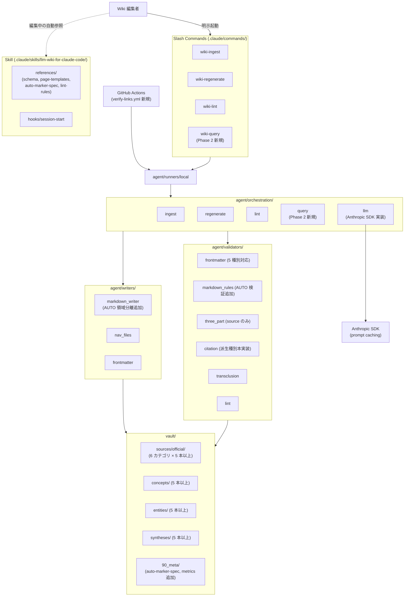

# 設計書

## アーキテクチャ概要

Phase 2 では Phase 1 で確立した **「Slash Command + Skill + 環境非依存ロジック層 + 薄いランナー」** の 4 要素アーキテクチャを維持し、以下の 5 軸で**機能拡張**する:

1. **agent/orchestration/llm.py** をスタブから Anthropic SDK 実呼び出しへ置換（prompt caching 必須）
2. **agent/validators/** に派生種別（concept / entity / synthesis）対応を追加し、`type` 別検証マトリクスを完成させる
3. **agent/writers/markdown_writer.py** に AUTO 領域分離書き換えロジックを追加（領域外バイト一致保持）
4. **agent/orchestration/query.py** を新規追加し、`/wiki-query` を Slash Command として導入
5. **vault/** に派生種別 15 本以上、公式 4 カテゴリ × 5 本以上 = 計 30 本以上の記事を配置



### 採用方針（Phase 2 増分）

- **言語・ツールチェイン**: Phase 1（Python 3.12+ / uv / pytest / ruff / mypy strict、ADR-010）を継続
- **Anthropic SDK 統合**: `anthropic>=0.40` を `pyproject.toml` の `dependencies` に追加。**Sonnet 4.6 を既定モデル**（`claude-sonnet-4-6`）とし、`agent regenerate --model claude-opus-4-7` 等で切替可能
- **prompt caching 必須化**: system プロンプト（規約参照ブロック、約 4-8KB）と Skill `references/` の主要 3 本（`frontmatter-spec.md`, `markdown-rules.md`, `auto-marker-spec.md`）に `cache_control: {"type": "ephemeral"}` を付与
- **LLM バックエンド切替**: `WIKI_LLM_BACKEND=stub|anthropic` 環境変数で test 用 stub と本番 Anthropic を切替（CI / 統合テストはネットワーク非依存維持）
- **AUTO マーカーは `source` 種別のみ**: 派生種別では AUTO マーカーを採用しない（派生種別は LLM 全文書き換え前提、領域分離不要）
- **派生種別の引用必須**: `concept` / `entity` / `synthesis` は `sources` frontmatter キーに最低 1 件の wikilink を持つ。`citation_validator` で引用先実在を強制
- **`comparison` 種別はスキーマのみ**: テンプレートと JSON Schema は配置するが記事生成は Phase 3
- **CI 二系統**: `validate.yml`（既存・ネットワーク非依存）と `verify-links.yml`（新規・週次・許容失敗）を分離（ADR-007 の延長）

## コンポーネント設計

### 1. agent/orchestration/llm.py — Anthropic SDK 実装への置換

**責務**:
- 公式 Python SDK（`anthropic.Anthropic`）でメッセージ API を呼び出し、要約・補足解説・confidence 自己評価を生成
- prompt caching を有効化し、system プロンプト + 規約 references を共有キャッシュ化
- ストリーミング応答を集約し、`LLMResult` を返す

**インターフェース**:

```python
from dataclasses import dataclass
from typing import Literal

@dataclass
class LLMResult:
    body: str            # 記事本文（frontmatter は含まない）
    confidence: float    # 0.0-1.0
    suggested_entities: list[str]   # 派生 entity 候補（slug）
    suggested_concepts: list[str]   # 派生 concept 候補（slug）
    usage: dict          # cache_read_input_tokens, input_tokens, output_tokens

class AnthropicLLM:
    def __init__(self, api_key: str, model: str = "claude-sonnet-4-6"): ...
    def generate(
        self,
        system_blocks: list[dict],   # cache_control 付きブロック
        user_prompt: str,
        max_tokens: int = 4096,
    ) -> LLMResult: ...
```

**実装の要点**:
- `client.messages.create()` で `system` パラメータに `cache_control` 付きブロック配列を渡す
- `system_blocks` は orchestration 側で `[{"type":"text","text": ref_content, "cache_control":{"type":"ephemeral"}}]` を組み立てる
- 失敗時は `LLMGenerationError` を raise（呼び出し側で終了コード 3 へマップ）
- `WIKI_LLM_BACKEND=stub` の場合は既存 `StubLLM` を返す Factory（`make_llm()` 関数）

### 2. agent/validators/frontmatter_validator.py — 5 種別対応

**責務**: frontmatter の `type` キーに応じて 5 種別の必須キー・型・enum 値を検証

**`type` 別必須キーマトリクス（Phase 2 確定）**:

| キー | source | concept | entity | synthesis | comparison |
|------|:------:|:-------:|:------:|:---------:|:----------:|
| `title`, `type`, `confidence`, `last_updated`, `stale`, `tags` | ✓ | ✓ | ✓ | ✓ | ✓ |
| `sources`（最低件数） | 0 | 1+ | 1+ | 1+ | 2+ |
| `source_url`, `fetched_at`, `claude_code_version` | ✓ | - | - | - | - |
| `entity_kind`（enum: tool/command/person/model） | - | - | ✓ | - | - |
| `query`, `query_executed_at` | - | - | - | ✓ | - |
| `compared_targets`（配列、最低 2 件） | - | - | - | - | ✓ |
| `reviewer`, `human_edited`, `status`, `auto_section_managed` | ✓ | ✓ | ✓ | ✓ | ✓ |

**実装の要点**:
- `vault/90_meta/_schemas/frontmatter.schema.json` の `oneOf` 分岐で `type` 値ごとに `required` を切替
- バリデータは JSON Schema を読み込み `jsonschema` で検証 + 補助的な型 / enum チェック
- エラーメッセージは `file_path:key` 形式で `stderr` に出力

### 3. agent/validators/citation_validator.py — 派生種別の引用検証本実装

**責務**: `concept` / `entity` / `synthesis` / `comparison` の `sources` 配列が最低件数を満たし、各 wikilink ターゲットが Vault 内に実在することを検証

**実装の要点**:
- Phase 1 ではスタブだったロジックを本実装
- `sources: ["[[hooks/pre-tool-use]]", "[[concepts/permission-mode]]"]` のような wikilink 配列を解析
- 各 wikilink の解決先（`vault/**/<slug>.md`）が存在しない場合は `CitationTargetMissingError`
- `comparison` のみ最低 2 件、それ以外は最低 1 件

### 4. agent/validators/markdown_rules_validator.py — AUTO マーカー検証追加

**責務**: 既存の Dataview / Callout 検出に加え、AUTO マーカーの構文・配置位置を検証

**追加検証**:
- `<!-- AUTO:START -->` と `<!-- AUTO:END -->` のペア整合性（孤立・順序逆転をエラー）
- AUTO 領域のネスト禁止
- `source` 種別以外の記事に AUTO マーカーが存在する場合はエラー
- `source` 種別で AUTO 領域が「## 補足解説 (日本語)」以外のセクション配下にある場合はエラー
- 1 記事あたり AUTO 領域は最大 1 つ

### 5. agent/writers/markdown_writer.py — AUTO 領域分離書き換え

**責務**: AUTO 領域抽出 + 書き換えロジックを追加し、領域外をバイト単位で保持

**新インターフェース**:

```python
@dataclass
class WriteRequest:
    file_path: Path
    frontmatter: dict
    full_body: str | None = None         # 全文書き換え（既存 / 派生種別）
    auto_section_body: str | None = None # AUTO 領域のみ書き換え（source 種別 + auto_section_managed:true）

class MarkdownWriter:
    def write(self, req: WriteRequest) -> WriteResult: ...
```

**動作**:
- `auto_section_managed: true` かつ `auto_section_body` が指定された場合のみ AUTO 領域分離書き換え
- 既存ファイルから AUTO 領域を正規表現で抽出（`<!-- AUTO:START -->\n(.*?)\n<!-- AUTO:END -->` の DOTALL）
- 領域内のみ `auto_section_body` で置換、領域外（前後）はバイト一致で保持
- AUTO マーカーが存在しない場合はエラー（`AutoMarkerMissingError`）

**冪等性**:
- AUTO 領域のみ書き換える場合、Writer は領域外を一切触らない
- 領域内の差分が「タイムスタンプ等の機械的更新のみ」の場合、`changed: false` を返す

### 6. agent/orchestration/query.py — `/wiki-query` 新規実装

**責務**: 自然言語クエリから関連ページを抽出し、`synthesis` 種別ページを生成

**ユースケース**:

```
query(question: str, force: bool = False) -> WriteResult:
  1. question から検索キーワードを抽出（LLM 経由 or 単純な keyword 抽出）
  2. vault/ 配下の source / concept / entity を frontmatter.tags + 全文で抽出
     → スコアリング上位 N 件（既定 N=10）を候補として確保
  3. 既存の同一クエリ synthesis（query フィールド一致）を検索
     → 既存があり --force でなければ「既存 synthesis があります」と表示し終了（exit 0）
  4. 候補ページの本文 + クエリを LLM プロンプトに組み立て
  5. LLM が集約結果を生成（要約 + 引用元の wikilink リスト + confidence）
  6. writer が vault/syntheses/<slug>.md を type=synthesis で生成
     - frontmatter.query / query_executed_at / sources を埋める
  7. log.md / index.md 更新
  8. WriteResult を返す
```

**slug 生成**:
- クエリのハッシュ（SHA-256 先頭 8 文字）+ クエリの先頭を slugify した文字列を組み合わせる（例: `a1b2c3d4-how-to-configure-hooks`）
- 既存ファイル衝突時は `--force` がない限り上書きしない

### 7. agent/orchestration/regenerate.py — 実 LLM + AUTO マーカー対応

**責務**: 既存 source 記事の再生成で、AUTO 領域のみ更新するモードを追加

**動作変更**:
- 対象記事の `auto_section_managed` を読み取り:
  - `true`: AUTO 領域のみ書き換え（人手領域は保持）
  - `false`: 全文書き換え（Phase 1 と同じ動作）
- `agent regenerate --target <path> --auto-only` フラグで強制 AUTO 領域のみ書き換え（移行期の検証用）

### 8. vault/90_meta/auto-marker-spec.md（新規）

**配置内容**:
- 構文定義: `<!-- AUTO:START -->` 〜 `<!-- AUTO:END -->`、ネスト禁止
- 配置位置: `source` 種別の「## 補足解説 (日本語)」配下のみ
- 1 記事あたり最大 1 領域
- `auto_section_managed: true` の場合のみ Writer が領域内を書き換える
- 領域外バイト一致保持の Writer 実装と検証テスト要件

### 9. vault/90_meta/metrics.md（新規）

**配置内容**:
- 表形式で記事ごとの計測値を記録
- カラム: `path`, `created_at`, `review_minutes`, `reviewer`, `auto_fixes`, `manual_fixes`, `notes`
- ページ末尾に集計値（記事数、平均レビュー時間、修正率）

### 10. .github/workflows/verify-links.yml（新規）

**設定**:
```yaml
name: verify-links
on:
  schedule:
    - cron: "0 0 * * 1"   # 月曜 UTC 0 時
  workflow_dispatch:
jobs:
  verify:
    runs-on: ubuntu-latest
    continue-on-error: true
    steps:
      - uses: actions/checkout@v4
      - uses: astral-sh/setup-uv@v3
      - run: uv sync
      - id: verify
        run: uv run agent verify-links
      - if: steps.verify.outcome == 'failure'
        uses: actions/github-script@v7
        with:
          script: |
            // [verify-links] drift detected: YYYY-MM-DD タイトルで Issue 起票
```

## データフロー

### ユースケース 1: 実 LLM regenerate（`/wiki-regenerate <path>` → AUTO 領域のみ更新）

```
1. wiki-regenerate.md → agent regenerate --target <path>
2. regenerate.regenerate_source() 起動
3. Writer が target frontmatter を読み、type=source / auto_section_managed=true を確認
4. Validator が source_url のホワイトリスト検証
5. Fetcher が source_url から raw コンテンツ取得（exit 2 で fail-fast）
6. content_hash 比較で更新要否判定（一致なら exit 0、no changes）
7. AnthropicLLM が prompt caching 付きで AUTO 領域用本文を生成
   - system: 規約 references 3 本（cache_control: ephemeral）
   - user: 既存記事 + raw コンテンツ + AUTO 領域生成指示
8. Writer が AUTO 領域のみ書き換え（領域外バイト一致保持）
9. log.md 更新
10. exit 0
```

### ユースケース 2: `/wiki-query` 実行

```
1. wiki-query.md → agent query --question "..."
2. query.query() 起動
3. 既存 synthesis 検索（query 一致）→ あれば --force なしなら exit 0
4. Vault 内 source / concept / entity の関連ページ抽出（tags + 全文スコアリング）
5. AnthropicLLM が候補ページ + クエリで集約生成
6. Writer が vault/syntheses/<slug>.md を生成
7. log.md / index.md 更新
8. exit 0
```

### ユースケース 3: verify-links CI 別ジョブ

```
1. cron / workflow_dispatch で .github/workflows/verify-links.yml 起動
2. uv run agent verify-links 実行（continue-on-error: true）
3. 各記事の source_url HEAD 200 確認 + 連続 100 文字一致なし検査
4. drift 検出時は agent が exit 非ゼロ
5. workflow が actions/github-script で Issue 起票（タイトル [verify-links] drift detected: YYYY-MM-DD）
6. ジョブは success（continue-on-error）
```

## エラーハンドリング戦略

### 追加カスタムエラークラス

```python
class AutoMarkerMissingError(WikiError): ...    # AUTO 領域が必要だが存在しない
class AutoMarkerInvalidError(WikiError): ...    # AUTO マーカーがネスト等で不正
class CitationTargetMissingError(WikiError): ...# 派生種別の引用先が実在しない
class QueryDuplicateError(WikiError): ...       # 同一クエリ synthesis が既存
class LLMQuotaExceededError(LLMGenerationError): ...  # API レート / 予算超過
```

### ハンドリングパターン（Phase 1 から拡張）

| エラー種別 | 処理 | 終了コード |
|-----------|------|-----------|
| ホワイトリスト外ソース | 即時エラー、処理中断 | 2 |
| 情報源取得失敗 | 該当記事は更新せず、エラーログ | 2 |
| frontmatter 検証エラー | エラー出力、CI fail | 1 |
| Markdown 制約違反（含 AUTO 構文） | エラー出力、CI fail | 1 |
| AUTO マーカー不在（auto_section_managed:true 時） | 該当記事のみ skip + warning | 0（warning） |
| 引用先不在（派生種別） | エラー出力、CI fail | 1 |
| LLM 生成失敗 / API 失敗 | 記事を更新せず、ログ残し | 3 |
| API レート / 予算超過 | エラー出力、再試行ガイド | 3 |
| `/wiki-query` 同一クエリ既存（--force なし） | warning + 終了 | 0 |

## テスト戦略

### ユニットテスト（追加分）

- `orchestration/llm`: Anthropic SDK モック化（`pytest-httpx` 等）、prompt caching の `cache_control` 付与確認、`WIKI_LLM_BACKEND` 切替動作
- `validators/frontmatter_validator`: 5 種別 × 必須キー欠損 / 型不一致 / enum 違反パターン
- `validators/citation_validator`: 派生種別の引用先実在 / 不在ケース、最低件数違反
- `validators/markdown_rules_validator`: AUTO マーカー孤立・ネスト・配置不正のパターン
- `writers/markdown_writer`: AUTO 領域抽出・書き換え・領域外バイト一致保持・冪等性
- `orchestration/query`: 候補抽出スコアリング、既存 synthesis 検出、`--force` 動作

### 統合テスト（追加分）

- `regenerate-auto/`: AUTO 領域のみ書き換え、人手領域がバイト一致で保持されることを確認
- `query/`: 自然言語クエリ → synthesis 生成の E2E、冪等性（連続 2 回で既存検出）
- `derived-types/`: concept / entity / synthesis 各 1 本生成 → validate PASS

### E2E テスト（追加分）

- Slash Command `/wiki-query "<質問>"` 実行 → `vault/syntheses/<slug>.md` が生成され、`type: synthesis` + 引用先実在を満たす
- `/wiki-regenerate <path>` で AUTO 領域のみ書き換え、領域外バイト一致を `git diff` で確認

### CI チェック

- `.github/workflows/validate.yml`: 既存検証に加え派生種別の `agent validate --all` を含める
- `.github/workflows/verify-links.yml`: 新規、週次 + 手動、許容失敗
- AUTO 領域保持の integration テストが PR ごとに実行される

## 依存ライブラリ（Phase 2 増分）

```toml
# pyproject.toml 追記分
[project]
dependencies = [
    # 既存（Phase 1）
    "python-frontmatter>=1.1",
    "httpx>=0.27",
    "pyyaml>=6.0",
    "jsonschema>=4.20",
    # Phase 2 追加
    "anthropic>=0.40",
]

[dependency-groups]
dev = [
    # 既存
    "pytest>=8.0",
    "pytest-asyncio>=0.23",
    "ruff>=0.6",
    "mypy>=1.10",
    # Phase 2 追加
    "pytest-httpx>=0.30",   # Anthropic SDK モック
]
```

## ディレクトリ構造（Phase 2 終了時の差分）

```
wiki-for-claude-code/
├── vault/
│   ├── sources/official/
│   │   ├── cli/                    # 6 本（うち 1 本書き直し）→ 全て published
│   │   ├── hooks/                  # 5 本（うち 1 本書き直し）→ 全て published
│   │   ├── slash-commands/         # ★ 5 本以上（新規）
│   │   ├── mcp/                    # ★ 5 本以上（新規）
│   │   ├── settings/               # ★ 5 本以上（新規）
│   │   └── sdk/                    # ★ 5 本以上（新規）
│   ├── concepts/                   # ★ 5 本以上（新規）
│   ├── entities/                   # ★ 5 本以上（新規）
│   ├── syntheses/                  # ★ 5 本以上（新規、/wiki-query 結果）
│   └── 90_meta/
│       ├── auto-marker-spec.md     # ★ 新規
│       ├── metrics.md              # ★ 新規
│       └── _schemas/
│           └── frontmatter.schema.json  # ★ 派生 4 種別追加
├── .claude/
│   ├── commands/
│   │   ├── wiki-ingest.md
│   │   ├── wiki-regenerate.md
│   │   ├── wiki-lint.md
│   │   └── wiki-query.md           # ★ 新規
│   └── skills/llm-wiki-for-claude-code/
│       └── references/
│           ├── auto-marker-spec.md → ../../../vault/90_meta/auto-marker-spec.md  # ★ 新規シンボリックリンク
│           └── page-templates.md   # ★ 派生 4 種別の実体テンプレート追加
├── agent/
│   ├── orchestration/
│   │   ├── llm.py                  # ★ Anthropic SDK 実装に置換
│   │   ├── query.py                # ★ 新規
│   │   └── regenerate.py           # ★ AUTO 領域対応
│   ├── validators/
│   │   ├── frontmatter_validator.py # ★ 5 種別対応
│   │   ├── citation_validator.py   # ★ 本実装
│   │   └── markdown_rules_validator.py # ★ AUTO 検証追加
│   ├── writers/
│   │   └── markdown_writer.py      # ★ AUTO 領域分離書き換え
│   └── runners/local.py            # ★ query / --auto-only サブコマンド追加
├── .github/workflows/
│   ├── validate.yml                # 派生種別 validate 追加
│   └── verify-links.yml            # ★ 新規
└── docs/core/decisions.md          # ★ ADR-015 (AUTO マーカー構文) / ADR-016 (派生種別規約) を追加
```

## 実装の順序

Phase 2 はリスクと依存関係を考慮し、以下の順で進める:

1. **ADR-015 起票**: `docs/core/decisions.md` に AUTO マーカー構文 ADR を追加し、`vault/90_meta/auto-marker-spec.md` を新規作成
2. **frontmatter 規約・JSON Schema 拡充**: 派生 4 種別を追加し、`frontmatter_validator` を拡張 + テスト
3. **citation_validator 本実装**: 派生種別の引用必須・引用先実在チェックを実装 + テスト
4. **markdown_rules_validator に AUTO 検証追加**: 構文・配置位置・ネスト禁止を検出 + テスト
5. **markdown_writer に AUTO 領域分離書き換え追加**: 領域外バイト一致保持を実装 + テスト
6. **Anthropic SDK 統合**: `agent/orchestration/llm.py` をスタブから置換、`WIKI_LLM_BACKEND` 切替、prompt caching 実装 + 統合テスト（モック）
7. **drift 記事 2 本の全面書き直し**: 実 LLM 経由で書き直し、人手レビューで `published` 化
8. **既存 8 本の `published` 昇格**: 個別仕様精査、補足解説加筆、`confidence ≥ 0.7` 化
9. **既存記事への AUTO 領域導入**: 30 本以上の `source` 記事に AUTO マーカーを配置、`auto_section_managed: true` 化
10. **公式 4 カテゴリ展開**: `slash-commands` / `mcp` / `settings` / `sdk` 各 5 本以上を `agent ingest` で生成 + レビュー
11. **派生種別記事の生成**: `concept` / `entity` 各 5 本以上を手動 + LLM 補助で執筆
12. **`/wiki-query` 実装**: `agent/orchestration/query.py` 新規 + Slash Command `wiki-query.md` 配置 + テスト
13. **`/wiki-query` を実運用**: 5 件以上の query を実行し `vault/syntheses/` に synthesis 記事を蓄積
14. **`verify-links.yml` CI 統合**: 新規 workflow + Issue 起票 script を追加
15. **metrics.md 記録**: Phase 2 で生成・レビューした全記事の計測値を集計
16. **CLAUDE.md 運用ガード文削除**: `agent regenerate` の本番運用ガードを解除
17. **受入れテスト**: Phase 1 と同様の自動 + 手動チェック、PASS 化

## セキュリティ考慮事項

- **`ANTHROPIC_API_KEY`** は `.env`（`.gitignore` 済み）または GitHub Secrets で管理。リポジトリにコミットしない（`secret-scan` を pre-commit hook で実装検討）
- **prompt caching** の system ブロックに API キーや個人情報を含めない（規約 references のみ）
- **連続 100 文字一致検出** を `transclusion_validator` で全 source 記事に対して継続実施
- **取得元への過度なアクセス**: Phase 1 の `User-Agent` 設定 + 100ms sleep を継続。AUTO 領域のみ更新の差分検知で不要なフェッチを削減
- **Issue 起票 script** の権限は最小権限（`issues: write` のみ）

## パフォーマンス考慮事項

- **prompt caching ヒット率**: regenerate 連続 2 回目以降の `cache_read_input_tokens` が `input_tokens` の 80% 以上を占めることを目標
- **トークンコスト**: 1 記事の regenerate コストを `metrics.md` で計測（目標: prompt caching により Sonnet 4.6 で記事 1 本あたり $0.02 以下）
- **`/wiki-query` 応答時間**: 候補抽出 + LLM 集約で 30 秒以内（PRD 非機能要件）
- **AUTO 領域のみ更新の差分検知**: content_hash 一致時は LLM 呼び出し自体を省略（不要コストゼロ）

## 将来の拡張性

Phase 2 のインターフェースは Phase 3 拡張を見越して設計:

- **`comparison` 自動生成（Phase 3）**: `agent/orchestration/compare.py` を追加、複数 `entity` / `concept` を LLM に渡して `comparison` 種別を生成。スキーマとテンプレートは Phase 2 で配置済
- **コミュニティソース取り込み（Phase 3）**: `agent/fetchers/rss_fetcher.py`, `github_fetcher.py` を `Fetcher` プロトコル準拠で追加
- **GitHub Actions 週次 cron（Phase 3）**: `agent/runners/action.py` を本実装、`agent/orchestration/` を直接呼ぶ。`verify-links.yml` で確立した CI パターンを再利用
- **CODEOWNERS / PR テンプレート（Phase 3）**: 自動 PR が増える Phase 3 で導入
- **Anthropic Routines / Schedule への移行**: ロジック層は環境非依存（ADR-007）のため低コストで切替可能。Phase 3 安定後に再検討
- **セマンティック検索（200 ページ超で検討）**: `/wiki-query` の候補抽出を tags + 全文 → ベクトル検索に置換するだけで対応
