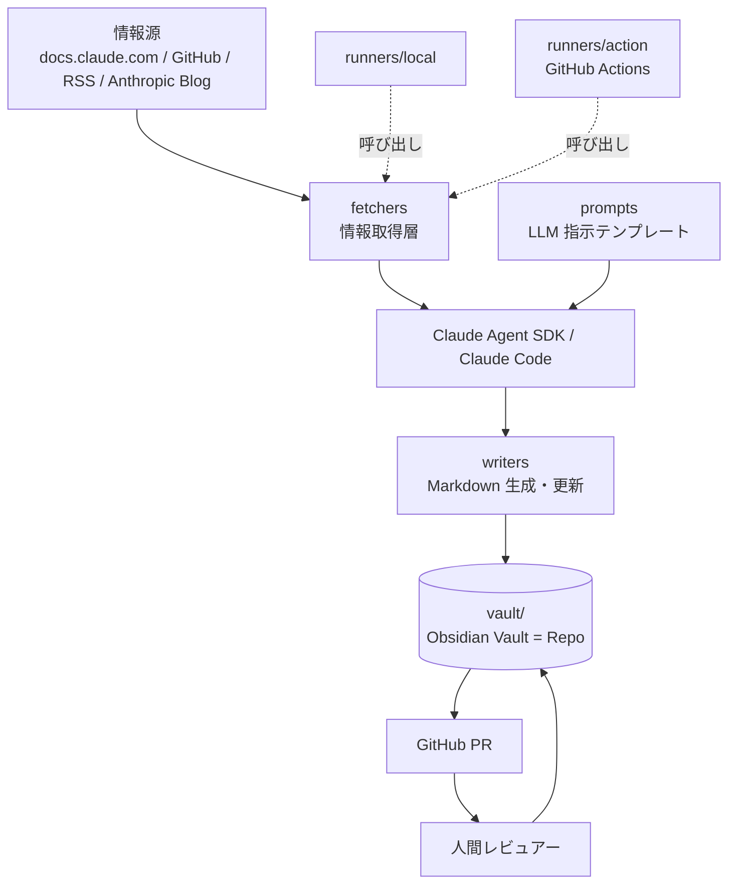
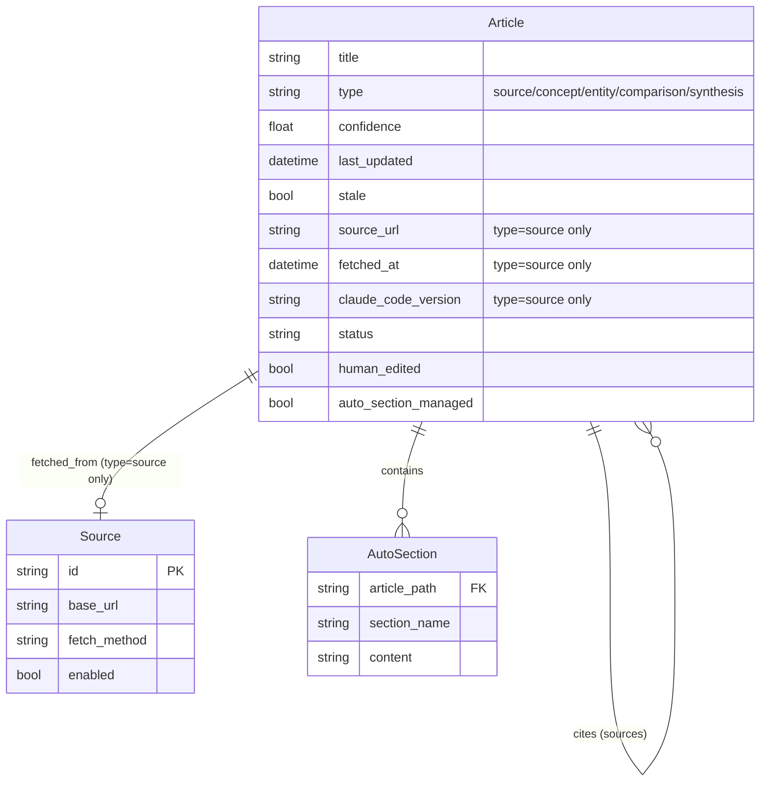
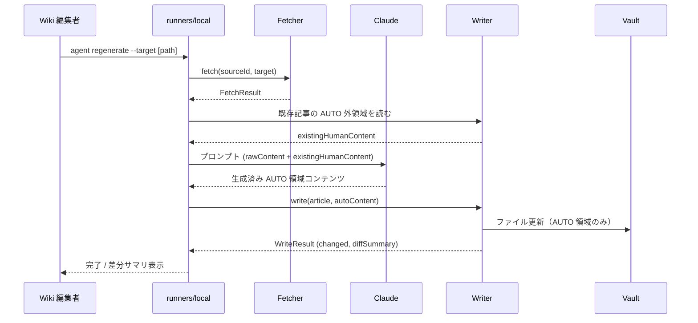
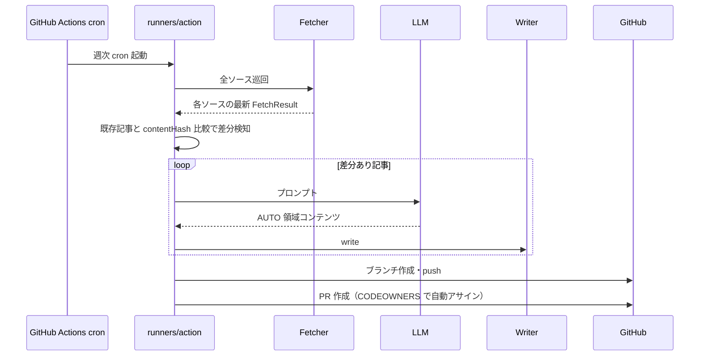
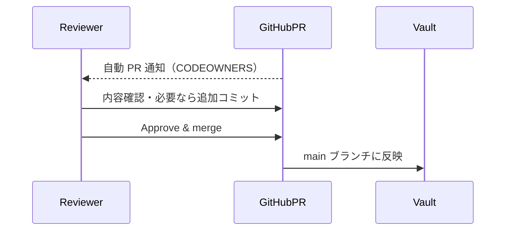

> **ステータス: 計画段階**
> このドキュメントは `docs/ideas/20260505-llm-wiki-for-claude-code.md` から生成されました。
> 実装後は `/update-docs` で実態に同期してください。

# 機能設計書 (Functional Design Document)

## 本ドキュメントの責務

本ドキュメントはユースケース単位の詳細設計を扱う。具体的には:

- システム構成図
- データモデル定義（エンティティ・ER 図）
- コンポーネント設計（責務・インターフェース・依存関係）
- ユースケース図（シーケンス図）
- ファイル構造の例
- アルゴリズム設計
- エラーハンドリングの分類

横断的決定（技術スタック、レイヤー責務、非機能要件、テスト戦略、依存関係管理）は [`architecture.md`](./architecture.md) に集約している。
コーディング規約・Git 運用・コンテンツ規約は [`development-guidelines.md`](./development-guidelines.md) を参照。

## システム構成図



## データモデル定義

### エンティティ: Article（記事、`type` 別）

Markdown ファイル（YAML frontmatter + 本文）として表現される。Phase 1 では `type: source` のみ実装。

```yaml
---
title: "Pre-Tool-Use Hook"
type: source                                            # source / concept / entity / comparison / synthesis
confidence: 0.9                                         # 0.0-1.0 信頼度
sources: []                                             # 引用元 wikilink 配列（source 種別自身は空）
last_updated: 2026-05-05
stale: false
tags: [hooks, pre-tool-use]
source_url: "https://code.claude.com/docs/ja/hooks"     # type=source のみ必須（日本語版を原典に採用）
fetched_at: "2026-05-05T10:00:00Z"                     # type=source のみ必須 (ISO 8601)
source_version: null                                    # type=source のみ
claude_code_version: "1.5.0"                            # type=source のみ必須
reviewer: "tak"
human_edited: true
status: published                                       # draft / reviewed / published
auto_section_managed: false                             # Phase 2 で AUTO マーカー対応時に true
---

## 概要 (要約)
（公式の核となるポイントを日本語で要約。3-5文程度）

## 公式ドキュメント
→ https://code.claude.com/docs/ja/hooks
（最終確認: 2026-05-06 / 対象バージョン: 1.5.0）

## 補足解説 (日本語)
（実際の利用例、ハマりどころ、関連機能との関係など）
```

**制約**（`type: source`）:
- `source_url` は `vault/90_meta/sources.md` に記載されたホワイトリスト済みドメインに限る
- `status` は `draft → reviewed → published` の単方向遷移のみ
- `claude_code_version` は SemVer 形式
- 3部構成（「## 概要 (要約)」「## 公式ドキュメント」「## 補足解説 (日本語)」）必須
- 全文転載禁止（公式コンテンツの連続100文字一致は不可）

**派生種別の制約**（`type: concept` / `entity` / `comparison` / `synthesis`、Phase 2 以降）:
- `sources` frontmatter キーに引用元 wikilink を1つ以上必須
- 引用ターゲットが実在することを `citation_validator` で検証
- 3部構成は不要（自由構成）

### エンティティ: Source（情報源）

`vault/90_meta/sources.md` で管理されるホワイトリスト。

```yaml
- id: anthropic-claude-code-docs-ja
  name: "Anthropic Claude Code 公式ドキュメント (日本語版)"
  base_url: "https://code.claude.com/docs/ja/"
  fetch_method: "scrape"          # rss / api / scrape
  rate_limit: "10 req/min"
  license_notes: "vault/90_meta/license-notes.md#anthropic-claude-code-docs"
  enabled: true
- id: anthropic-claude-code-docs-en
  name: "Anthropic Claude Code 公式ドキュメント (英語版、補完用)"
  base_url: "https://code.claude.com/docs/en/"
  fetch_method: "scrape"
  rate_limit: "10 req/min"
  license_notes: "vault/90_meta/license-notes.md#anthropic-claude-code-docs"
  enabled: true
- id: anthropic-blog-rss
  name: "Anthropic ブログ RSS"
  base_url: "https://www.anthropic.com/news"
  fetch_method: "rss"
  feed_url: "https://www.anthropic.com/news/rss.xml"  # 要確認
  enabled: true
```

### ER図



## コンポーネント設計

### Fetcher（情報取得）

**責務**:
- ホワイトリスト済み情報源から最新コンテンツを取得
- レート制限を遵守
- 取得失敗時はエラーを返し、記事は更新しない

**インターフェース**（言語非依存の概念）:
```typescript
// TypeScript 例（Python 実装の場合は Protocol で同義の定義）
interface Fetcher {
  /** ソース ID から最新の生コンテンツを取得 */
  fetch(sourceId: string, target: string): Promise<FetchResult>;
}

interface FetchResult {
  rawContent: string;
  fetchedAt: string;       // ISO 8601
  sourceVersion?: string;
  contentHash: string;     // 差分検知用
}
```

**依存関係**:
- `vault/90_meta/sources.md`（ホワイトリスト読み込み）
- HTTP クライアント / RSS パーサ / GitHub API クライアント

### Writer（Markdown 生成・更新）

**責務**:
- LLM の出力を Markdown に整形
- AUTO セクションマーカー領域のみ書き換え（Phase 2 以降）
- frontmatter の更新
- 既存ファイルとの差分判定（無意味な差分を出さない）

**インターフェース**:
```typescript
interface Writer {
  /** 既存記事を更新（AUTO 領域のみ）または新規記事を書き出す */
  write(article: Article, autoContent: string): Promise<WriteResult>;
}

interface WriteResult {
  filePath: string;
  changed: boolean;       // 意味のある差分があったか
  diffSummary: string;
}
```

**依存関係**:
- `vault/90_meta/markdown-rules.md`（許可記法）
- `vault/90_meta/auto-marker-spec.md`（Phase 2 以降）

### Prompt（LLM 指示テンプレート）

**責務**:
- 各カテゴリ・各種類の記事に対する LLM プロンプトを管理
- `claude_code_version` などのコンテキスト変数を埋め込む

**インターフェース**:
```typescript
interface PromptTemplate {
  build(context: PromptContext): string;
}

interface PromptContext {
  rawContent: string;
  category: string;
  claudeCodeVersion: string;
  existingHumanContent?: string;  // AUTO 外を保持するため LLM に提示
}
```

### Runner（実行エントリポイント）

**責務**:
- スラッシュコマンド（`.claude/commands/wiki-*.md`）または GitHub Actions から呼ばれる薄いラッパ
- Orchestration ユースケース（ingest / regenerate / lint / validate）を起動
- ローカル CLI（`local.*`）と GitHub Actions（`action.*`）で共通の `agent/orchestration` を呼び出す

**スラッシュコマンド**（`.claude/commands/` 配下、ADR-014）:
```
/wiki-ingest <official-url>          # 内部で agent ingest を呼ぶ
/wiki-regenerate <path>              # 内部で agent regenerate を呼ぶ
/wiki-lint                           # 内部で agent lint を呼ぶ
```

**ローカル CLI**:
```bash
agent ingest --source-url https://code.claude.com/docs/ja/hooks --category hooks
agent regenerate --target vault/sources/official/hooks/pre-tool-use.md
agent lint --all
agent validate --all
```

**GitHub Actions エントリポイント**:
- 全ソース・全カテゴリを巡回
- 差分があった記事のみ Writer で更新
- 変更があれば PR を作成（タイトル・本文に変更ソース・diff サマリ・`claude_code_version` を含める）

## ユースケース図

### ユースケース1: ローカルでの単記事再生成



### ユースケース2: GitHub Actions 週次自動更新（Phase 3）



### ユースケース3: 人間レビュー〜マージ



## ファイル構造

```
vault/
├── index.md                # ナビゲーション本体
├── log.md                  # 全操作の追記専用ログ
├── overview.md             # 全体俯瞰
├── sources/                # type=source
│   ├── official/
│   │   ├── cli/
│   │   │   ├── basic-usage.md
│   │   │   └── ...
│   │   ├── hooks/
│   │   ├── slash-commands/
│   │   ├── mcp/
│   │   ├── settings/
│   │   └── sdk/
│   └── community/          # Phase 3 から
│       ├── tips/
│       ├── workflows/
│       ├── integrations/
│       └── troubleshooting/
├── concepts/               # type=concept（Phase 2 から）
├── entities/               # type=entity（Phase 2 から）
├── comparisons/            # type=comparison（Phase 3 で自動生成）
├── syntheses/              # type=synthesis（Phase 2 から）
├── 30_drafts/              # LLM 下書き（レビュー待ち）
└── 90_meta/
    ├── sources.md          # 情報源ホワイトリスト
    ├── frontmatter-spec.md
    ├── markdown-rules.md
    ├── license-notes.md    # 利用規約整理
    ├── lint-rules.md
    ├── _schemas/
    │   └── frontmatter.schema.json
    ├── auto-marker-spec.md # Phase 2
    ├── metrics.md          # レビュー工数実測（Phase 2）
    └── cost-log.md         # API コスト実測（Phase 3）
```

**記事ファイル例**:
```markdown
---
title: "Pre-Tool-Use Hook"
type: source
confidence: 0.9
sources: []
last_updated: 2026-05-05
stale: false
tags: [hooks, pre-tool-use]
source_url: "https://code.claude.com/docs/ja/hooks"
fetched_at: "2026-05-05T10:00:00Z"
source_version: null
claude_code_version: "1.5.0"
reviewer: "tak"
human_edited: true
status: published
auto_section_managed: true
---

## 概要 (要約)
<!-- AUTO:START -->
hooks は Claude Code が特定のイベント時に外部コマンドを実行する仕組み。
PreToolUse / PostToolUse / Stop などのイベントが定義されている。
<!-- AUTO:END -->

## 公式ドキュメント
→ https://code.claude.com/docs/ja/hooks
（最終確認: 2026-05-05 / 対象バージョン: 1.5.0）

## 補足解説 (日本語)
hooks の典型的な使い方として、PreToolUse でコマンド実行前に確認を挟む例が挙げられる。
（人手編集領域 — 自動 PR で上書きされない）
```

## アルゴリズム設計

### 差分検知（Phase 1 で簡易、Phase 3 で本格）

**目的**: API コール数を抑えるため、更新が必要な記事のみを再生成する

**ステップ**:
1. ソースから raw コンテンツを取得し、`contentHash`（SHA-256）を計算
2. 対象記事の frontmatter `fetched_at` と最後に保存された `contentHash`（拡張 frontmatter）を比較
3. ハッシュ一致 + `claude_code_version` 一致なら更新スキップ
4. それ以外は LLM 呼び出し

**閾値**:
- 強制再生成期間: 30日（同じハッシュでも30日経過したら再取得 → ハッシュ確認）

### AUTO セクションマーカー処理（Phase 2 以降）

**目的**: 自動生成領域と人手編集領域の分離

**ステップ**:
1. 既存記事から `<!-- AUTO:START -->` 〜 `<!-- AUTO:END -->` 外の領域を抽出
2. LLM プロンプトに「AUTO 外領域は変更禁止のコンテキスト」として渡す
3. LLM 出力から AUTO 領域内のみ取り出し、Writer に渡す
4. Writer は AUTO 領域のみ書き換え、それ以外はバイト一致で保持

## エラーハンドリング

### エラーの分類

| エラー種別 | 処理 | ユーザーへの表示 |
|-----------|------|-----------------|
| 情報源取得失敗（HTTP 5xx, タイムアウト） | 該当記事は更新せず、エラーログを残す。他記事は継続 | "Fetch failed for [source]: [reason]" |
| レート制限超過 | 該当ジョブを失敗扱いとし、次回実行を待つ | "Rate limit exceeded for [source]" |
| LLM 生成失敗 | PR を作成せず、Actions を fail | "LLM generation failed: [reason]" |
| frontmatter 検証エラー | CI を fail | "frontmatter validation error: [field]" |
| ホワイトリスト外ソース指定 | 即時エラー、処理中断 | "Source [id] is not in whitelist" |

## 関連ドキュメント

- 技術スタック・非機能要件・テスト戦略・依存関係管理: [`architecture.md`](./architecture.md)
- コーディング規約・Git 運用・コンテンツ規約: [`development-guidelines.md`](./development-guidelines.md)
- 設計判断の経緯（なぜこの設計か）: [`decisions.md`](./decisions.md)
