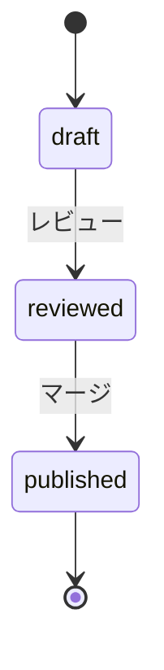

> **ステータス: 計画段階**
> このドキュメントは `docs/ideas/20260505-llm-wiki-for-claude-code.md` から生成されました。
> 実装後は `/update-docs` で実態に同期してください。

# プロジェクト用語集 (Glossary)

## 概要

このドキュメントは、LLM-Wiki for Claude Code プロジェクト内で使用される用語の定義を管理する。

**更新日**: 2026-05-05

## ドメイン用語

プロジェクト固有のビジネス概念や機能に関する用語。

### LLM-Wiki

**定義**: LLM が生成・維持し、人間が読み書きに関わる Wiki 形態の総称。Andrej Karpathy 氏が gist で提唱。

**説明**: Karpathy gist は Wiki を3レイヤー（Raw Sources / Wiki / Schema）で分離する設計を提案する。本プロジェクトはこの構造を採用しつつ、Reza Rezvani 氏 Medium 記事（2026-04）の Claude Code Skill 構造を取り入れ、Anthropic Usage Policy 対応のため `source` 種別に「要約 + リンク + 補足」3部構成を強制する独自要素を加えた折衷案として実装する。詳細は [`decisions.md` ADR-001](./decisions.md) を参照。

**関連用語**: Vault, AUTO セクションマーカー, ページ種別, Skill

**使用例**:
- 「本プロジェクトは LLM-Wiki for Claude Code として、Claude Code の最新情報を日本語で提供する」

**英語表記**: LLM-Wiki

### Wiki 記事 / Article

**定義**: `vault/` 配下に配置される個別の Markdown ファイル。`type` 別に5種類（source / concept / entity / comparison / synthesis）あり、frontmatter と本文で構成される。

**主要構成要素**:
- 共通 YAML frontmatter（`title`, `type`, `confidence`, `sources`, `last_updated`, `stale`, `tags` 等）
- `type=source` のみ追加 frontmatter（`source_url`, `fetched_at`, `claude_code_version` 等）
- 運用メタ（`reviewer`, `human_edited`, `status`, `auto_section_managed`）
- `type=source` のみ3部構成本文（「## 概要 (要約)」「## 公式ドキュメント」「## 補足解説 (日本語)」）
- 派生種別は `sources` キーで引用元 wikilink を必須とし、本文構成は自由

**関連用語**: frontmatter, AUTO セクションマーカー, Vault, ページ種別

### ページ種別 / Page Type

**定義**: Wiki ページを5つの分類に分ける枠組み。Karpathy gist と Rezvani Medium 記事に基づく。

**5種類**:

| 種別 | 役割 | 配置 | 導入 Phase |
|------|------|------|----------|
| `source` | 取込み元の要約 | `vault/sources/{official,community}/<category>/` | 1 |
| `concept` | 複数 source 横断の概念 | `vault/concepts/` | 2 |
| `entity` | ツール・コマンド・人物 | `vault/entities/` | 2 |
| `comparison` | 競合アプローチ比較 | `vault/comparisons/` | 3（自動生成） |
| `synthesis` | `/wiki-query` の結果保存 | `vault/syntheses/` | 2 |

**関連用語**: Article, frontmatter, コンパイル型 Wiki

### コンパイル型 Wiki / Compiled Wiki

**定義**: ソース取込み時に LLM が要約 + 派生ページ生成 + 相互参照維持 + 矛盾検出を行い、知識を「コンパイル済み」状態で保持する Wiki 構造。Karpathy gist が提唱。

**説明**: RAG が「クエリ時に毎回検索」するのに対し、コンパイル型 Wiki は「ソース取込み時に一度コンパイル」してその結果を再利用する。本プロジェクトはこの考え方を Claude Code ドメインに適用する。

**関連用語**: ページ種別, ingest, query, lint

### Skill（Claude Code Skill）

**定義**: Claude Code 上でコンテキストに応じて自動ロードされる、規約・テンプレート・hook の集合。`.claude/skills/<name>/` 配下に `SKILL.md`, `references/`, `hooks/` を配置する（Skill 単独でも `/<name>` のスラッシュコマンドとして機能するが、本プロジェクトでは Wiki 操作は Slash Command 層で扱う）。

**説明**: 本プロジェクトは `.claude/skills/llm-wiki-for-claude-code/` に **規約・テンプレート・hook** の Skill パッケージを配置し、Wiki ページ編集時に context-aware に参照される。Wiki 操作（ingest/regenerate/lint/query）はトップレベルの `.claude/commands/` に配置する Slash Command 側で扱う。Skill 内に `commands/` サブディレクトリは置かない（公式仕様外）。詳細は [`decisions.md` ADR-012](./decisions.md) および [ADR-014](./decisions.md) を参照。

**関連用語**: SKILL.md, Slash Command, references, hooks

### Slash Command（スラッシュコマンド）

**定義**: Claude Code 上で `/<name>` の形で明示的に起動できるコマンド。`.claude/commands/<name>.md` に自然言語指示書として配置する。

**説明**: 本プロジェクトでは Wiki 操作（`/wiki-ingest` `/wiki-regenerate` `/wiki-lint` `/wiki-query`）を `.claude/commands/` 配下に配置し、ユーザーが意図して呼ぶ操作の入り口とする。Skill 層が context-aware な規約参照を担うのに対し、Slash Command 層は副作用の大きい明示起動操作を担う。詳細は [`decisions.md` ADR-014](./decisions.md) を参照。

**関連用語**: Skill, ingest, regenerate, lint, query

### confidence（信頼度）

**定義**: 各 Wiki ページの自己評価信頼度。0.0〜1.0 の数値。LLM が ingest / regenerate 時に自己評価する。

**用途**:
- `/wiki-lint` で `confidence < 0.5` のページをフラグ立て
- Phase 1 受入基準: 全 `source` 記事で `confidence ≥ 0.7`
- ハルシネーション抑制と品質ガードの一翼

**関連用語**: lint, ingest, frontmatter

### 公式コンテンツ整理 / Official Content Curation

**定義**: Anthropic 公式ドキュメント（docs.claude.com 等）の核心を日本語で要約し、公式リンクと日本語補足を添えた記事化のこと（`type: source` の `vault/sources/official/` 配下）。

**説明**: 全文翻訳ではなく「要約 + リンク + 補足」の3部構造を採る。Anthropic Usage Policy / docs.claude.com の利用規約違反リスクを下げ、独自価値（解説）も付加する目的。

**関連用語**: コミュニティ知見の日本語化, ライセンス対応, ページ種別

### コミュニティ知見の日本語化 / Community Knowledge Translation

**定義**: anthropics/claude-code Releases, Anthropic ブログ RSS, awesome-claude-code 系リポジトリ等の英語コミュニティ知見を日本語化して `vault/sources/community/` 配下に `type: source` として整理すること（Phase 3 から）。

**説明**: Tips, ワークフロー事例, 他ツール連携, トラブルシュートの4カテゴリで構成。

### Vault

**定義**: Obsidian における Wiki / ノート集の単位。本プロジェクトでは `vault/` ディレクトリがこれに相当する。

**説明**: 本プロジェクトでは Obsidian Vault と Git リポジトリを同一ディレクトリに統合（Vault = Repo）し、別経路の同期問題を回避する。

**関連用語**: Wikilinks, Obsidian, Vault = Repo 統合

### Vault = Repo 統合

**定義**: Obsidian Vault と Git リポジトリを同一ディレクトリに統合する設計方針。

**説明**: Vault と Wiki を別管理にすると同期問題が発生するため、本プロジェクトではこれらを統合する。`.obsidian/` の一部のみ Git 管理対象とする。

### AUTO セクションマーカー / AUTO Section Marker

**定義**: Wiki 記事内で自動生成領域と人手編集領域を分離するためのマーカー。`<!-- AUTO:START -->` と `<!-- AUTO:END -->` で囲まれた範囲が自動生成領域となる。

**説明**: 自動 PR が人手編集を上書きする事故を防ぐため、Phase 2 で導入される。エージェントは AUTO 領域のみ書き換え、領域外はバイト一致で保持する。

**関連用語**: 自動 PR, Writer

**使用例**:
```markdown
## 概要
<!-- AUTO:START -->
（エージェントが上書きする領域）
<!-- AUTO:END -->

## 補足解説 (日本語)
（人手編集領域）
```

### 情報源ホワイトリスト / Source Whitelist

**定義**: エージェントが情報取得対象として許可しているソースのリスト。`vault/90_meta/sources.md` で管理。

**説明**: 利用規約違反やレート制限のリスクを抑えるため、許可されたソースのみから情報を取得する。RSS / 公式 API / 利用規約上問題ないソースのみを対象とする。

**関連用語**: ライセンス対応, Fetcher

### ライセンス対応 / License Notes

**定義**: Anthropic Usage Policy / docs.claude.com 利用規約 / 各コミュニティソースの利用規約を整理した運用ルール。`vault/90_meta/license-notes.md` に記録。

**説明**: 全文転載禁止、要約 + リンク + 補足構造の強制、出典明記等のルールを含む。

### 規約準拠記事 / Spec-Compliant Article

**定義**: frontmatter 規約 / Markdown 制約 / 3部構成 / 全文転載禁止 等の Wiki 規約をすべて満たす記事。

**説明**: Phase 1 完了基準として「規約準拠記事10本」が設定されている。

### 自動 PR / Automated PR

**定義**: Phase 3 で GitHub Actions が週次で自動作成する Pull Request。

**説明**: エージェントが情報源の差分を検知し、関連記事の AUTO 領域を更新した結果を PR にまとめる。CODEOWNERS で自動アサインされ、人間レビューを経てマージされる。

**関連用語**: 人手修正率, CODEOWNERS

### 人手修正率 / Human Modification Rate

**定義**: 自動 PR の総コミット数のうち、レビュー後に人手で追加されたコミットの割合。

**説明**: Phase 3 の成功指標の1つ。目標は 30% 以下。

**計算方法**: `人手追加コミット数 / 総コミット数`（4週間平均）

### 差分検知 / Diff Detection

**定義**: 情報源の最新コンテンツと既存記事の `contentHash` を比較し、変更があった記事のみを再生成対象とする仕組み。

**説明**: API コール数とコストを抑えるため、Phase 3 で本格導入される。

## 技術用語

プロジェクトで使用している技術・フレームワーク・ツールに関する用語。

### Claude Code

**定義**: Anthropic が提供する CLI 型のエージェント。本 Wiki の対象ドメイン。

**公式サイト**: https://code.claude.com/docs/ja/overview （日本語版）/ https://code.claude.com/docs/en/overview （英語版）

**本プロジェクトでの用途**:
- 開発フェーズでのエージェントロジック実行（ローカル）
- Wiki の対象ドメインそのもの

### Claude Agent SDK

**定義**: Claude を用いたエージェント開発のための SDK。Python と TypeScript 両方をサポート。

**本プロジェクトでの用途**: Phase 3 で GitHub Actions 上から週次更新エージェントを動かす際の基盤。

**バージョン**: 最新（要確認、Phase 1 で確定）

### Obsidian

**定義**: ローカルの Markdown ベースナレッジベース UI。Wikilinks・グラフビュー・全文検索を備える。

**公式サイト**: https://obsidian.md

**本プロジェクトでの用途**: `vault/` を Vault として開いた際の Wiki 閲覧・編集 UI。

### Wikilinks

**定義**: Obsidian / Wiki 系で使われる `[[file-name]]` 形式のリンク記法。

**本プロジェクトでの用途**: 記事間のリンク。標準 Markdown では認識されないが、Obsidian および本プロジェクトの portability 設計の範囲では許可記法とする。

### YAML frontmatter

**定義**: Markdown ファイル先頭の `---` で囲まれた YAML ブロック。記事のメタデータを格納する。

**本プロジェクトでの用途**: 記事の出典・鮮度・対象バージョン・ステータス等を機械可読な形式で管理。

**必須キー**: `source_url`, `fetched_at`, `source_version`, `claude_code_version`, `reviewer`, `human_edited`, `category`, `status`

**関連ドキュメント**: `vault/90_meta/frontmatter-spec.md`（Phase 1 で確定）

### GitHub Actions

**定義**: GitHub の CI/CD 基盤。

**本プロジェクトでの用途**: Phase 3 で週次 cron による自動更新を実行する基盤。

**関連ファイル**: `.github/workflows/weekly-update.yml`

### prompt caching

**定義**: Anthropic API の機能で、共通プロンプト部分をキャッシュして応答コストを削減する仕組み。

**本プロジェクトでの用途**: 共通の指示テンプレート部分でキャッシュを効かせ、月額コストを抑える。

## 略語・頭字語

### PR

**正式名称**: Pull Request

**意味**: GitHub における変更提案。本プロジェクトでは自動 / 人手両方の編集が PR 経由でマージされる。

### CI

**正式名称**: Continuous Integration

**意味**: 自動テスト・検証パイプライン。本プロジェクトでは frontmatter 規約・Markdown 制約・AUTO マーカー整合性等を検証する。

### MCP

**正式名称**: Model Context Protocol

**意味**: Claude などの LLM が外部ツール・データソースに接続するためのプロトコル。Wiki ドメインカテゴリの1つ（`vault/sources/official/mcp/`）。

### SDK

**正式名称**: Software Development Kit

**意味**: 本プロジェクト文脈では主に Claude Agent SDK を指す。

### RAG

**正式名称**: Retrieval-Augmented Generation

**意味**: LLM が外部知識を参照しながら応答する手法。本プロジェクトの将来拡張として「Wiki を RAG 用素材にする」案がある。

### KPI

**正式名称**: Key Performance Indicator

**意味**: 成功指標。本プロジェクトでは「規約準拠記事数」「人手修正率」「月次運用継続期間」等。

### CODEOWNERS

**正式名称**: -（GitHub の機能名）

**意味**: PR のレビュー担当を自動割当するための GitHub 機能。`.github/CODEOWNERS` で設定。

## アーキテクチャ用語

### 環境非依存ロジック / Environment-Agnostic Logic

**定義**: ローカル CLI と GitHub Actions の両方から同一ロジックを呼び出せる構造。

**本プロジェクトでの適用**: `agent/{fetchers,writers,prompts}` を環境非依存とし、`agent/runners/{local,action}` のみ環境固有とする。

**関連コンポーネント**: Runner, Orchestration

**図解**:
```
[runners/local]  [runners/action]
       ↓               ↓
   (Orchestration 共通層)
       ↓
[fetchers] [writers] [prompts]
```

### Fetcher

**定義**: ホワイトリスト済み情報源から最新コンテンツを取得するモジュール群（`agent/fetchers/`）。

**本プロジェクトでの適用**: ソース種別（RSS / GitHub API / スクレイプ）ごとに実装を分けつつ、共通インターフェースを持つ。

### Writer

**定義**: LLM の出力を Markdown に整形し、AUTO 領域のみを更新するモジュール群（`agent/writers/`）。

**本プロジェクトでの適用**: frontmatter 更新、差分判定、AUTO マーカー処理を担う。

### Runner

**定義**: 実行エントリポイント（`agent/runners/`）。

**本プロジェクトでの適用**:
- `local.{ts,py}`: ローカル CLI
- `action.{ts,py}`: GitHub Actions（Phase 3）

### Orchestration

**定義**: Fetcher → LLM → Writer をオーケストレーションするユースケース層。

**本プロジェクトでの適用**: 単記事再生成・全カテゴリ巡回などのユースケースを実装。Runner から呼ばれる。

## ステータス・状態

### 記事ステータス

各 Wiki 記事の `status` フィールドが取りうる値。

| ステータス | 意味 | 遷移条件 | 次の状態 |
|----------|------|---------|---------|
| `draft` | LLM 下書き、レビュー待ち | レビュー実施 | `reviewed` |
| `reviewed` | レビュー済み、公開準備中 | マージ実施 | `published` |
| `published` | 公開済み | （遷移なし） | - |

**状態遷移図**:


### 開発フェーズ

| フェーズ | 名称 | ページ種別軸 | 対象ソース軸 | 動作確認基準 |
|---------|------|------------|------------|-------------|
| Phase 1 | 規約確立 + Skill 雛形 + `source` 種別10本 | `source` のみ | 公式・hooks/cli の2カテゴリ | 規約準拠 source 記事10本、`/wiki-ingest` `/wiki-regenerate` `/wiki-lint` 動作、冪等性確認 |
| Phase 2 | 派生種別追加 + AUTO マーカー + 公式全6カテゴリ | `+ concept` `+ entity` `+ synthesis` | 公式の全6カテゴリ | 派生ページ各最低5本、`/wiki-query` 動作、レビュー工数実測 |
| Phase 3 | 自動化 + コミュニティ拡張 + comparison 自動生成 | `+ comparison`（自動生成） | 公式 + コミュニティ ホワイトリスト | 4週連続自動 PR、人手修正率30%以下、月次運用3ヶ月 |

## データモデル用語

### Article（記事）

**定義**: Wiki の中核エンティティ。Markdown ファイル + YAML frontmatter として表現される。

**主要フィールド**:
- `source_url`: 一次情報源 URL
- `fetched_at`: 最終取得日時（ISO 8601）
- `source_version`: 情報源側のバージョン（任意）
- `claude_code_version`: 対象 Claude Code バージョン（SemVer）
- `reviewer`: レビュー担当者
- `human_edited`: 人手編集フラグ
- `category`: カテゴリパス
- `status`: `draft` / `reviewed` / `published`

**関連エンティティ**: Source, AutoSection（Phase 2 以降）

**制約**:
- `source_url` はホワイトリスト済みドメインに限る
- `status` は単方向遷移
- 全文転載禁止

### Source（情報源）

**定義**: ホワイトリスト済み情報源を表すエントリ。`vault/90_meta/sources.md` で管理。

**主要フィールド**:
- `id`: ソース識別子
- `name`: 表示名
- `base_url`: ベース URL
- `fetch_method`: `rss` / `api` / `scrape`
- `rate_limit`: レート制限
- `enabled`: 有効フラグ

## エラー・例外

### SourceNotWhitelistedError

**クラス名**: `SourceNotWhitelistedError`

**発生条件**: ホワイトリスト外のソース ID が指定された場合

**対処方法**: `vault/90_meta/sources.md` を確認し、必要なら追加する（利用規約検証を経て）

**例**:
```typescript
throw new SourceNotWhitelistedError("unknown-source");
```

### FetchFailedError

**クラス名**: `FetchFailedError`

**発生条件**: 情報源の取得が HTTP 5xx / タイムアウト / レート制限で失敗した場合

**対処方法**:
- 一時的失敗 → 次回実行を待つ
- 恒久的失敗 → ソースの状態確認、ホワイトリストからの一時除外

**例**:
```typescript
throw new FetchFailedError("anthropic-blog-rss", "HTTP 503");
```

### FrontmatterValidationError

**クラス名**: `FrontmatterValidationError`

**発生条件**: 必須キー欠損 / 型不一致 / 単方向 status 遷移違反

**対処方法**: 該当記事の frontmatter を `vault/90_meta/frontmatter-spec.md` に従って修正

### LlmGenerationError

**クラス名**: `LlmGenerationError`

**発生条件**: Claude Agent SDK の LLM 呼び出しが失敗した場合

**対処方法**: PR は作成せず、Actions を fail させる。リトライは Phase 3 で個別に検討。

## 計算・アルゴリズム

### contentHash

**定義**: 取得した raw コンテンツの SHA-256 ハッシュ。差分検知に使用。

**実装箇所**: `agent/fetchers/`（言語確定後に確定パス決定）

**例**:
```
入力: <html>...</html>
出力: "a3f5e9...b2c1"  (SHA-256, 16進)
```

### 差分検知ロジック

**定義**: ソースの `contentHash` と既存記事の保存済みハッシュを比較し、変更があった記事のみ再生成対象とする。

**ステップ**:
1. ソースから raw コンテンツ取得
2. SHA-256 ハッシュ計算
3. 既存記事の保存ハッシュと比較
4. 一致 + 30日以内なら更新スキップ
5. それ以外は LLM 呼び出しへ進む
